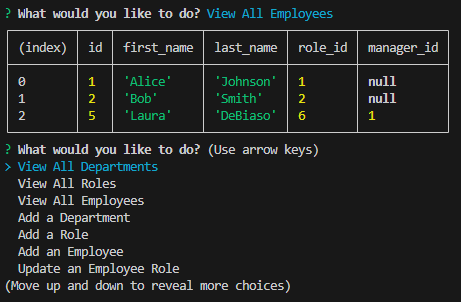

# SQL Challenge 10 CMS

## Description
This project uses the inquirer package in node.js to allow users to input information to generate and update SQL tables for an employee database.

## Table of Contents
- [Installation](#installation)
- [Usage](#usage)
- [License](#license)
- [Contributing](#contributing)
- [Tests](#tests)
- [Questions](#questions)

## Installation
Clone the repo from github and then run npm -i, and npm install inquirer to install the needed packages. You'll also need to ensure you're connected to Postgres and create a .env file with the following fields:
DB_HOST=
DB_PORT=
DB_USER=
DB_PASSWORD=
DB_NAME=

## Usage
To start the program, run node index.js in the integrated terminal.

## License
This project is licensed under the [MIT]([License](https://opensource.org/licenses/MIT)) license.

## Contributing
Natalie Gindraux. For those who add to this project, please submit a PR with identifying info

## Tests
To test that this is working, run node index.js and go through the prompts. Check to see that the tables are getting created & updated. 

## Questions
If you have any questions, please contact me at [nataliegindraux@gmail.com](mailto:nataliegindraux@gmail.com) or find me on GitHub [ngin2894](https://github.com/ngin2894).

